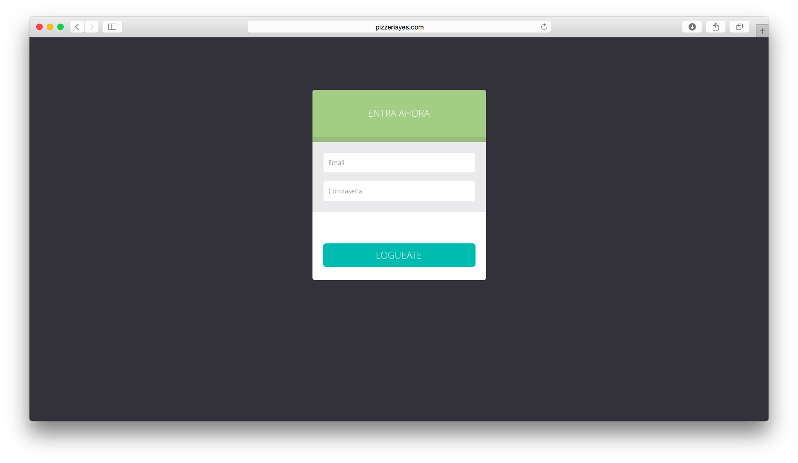
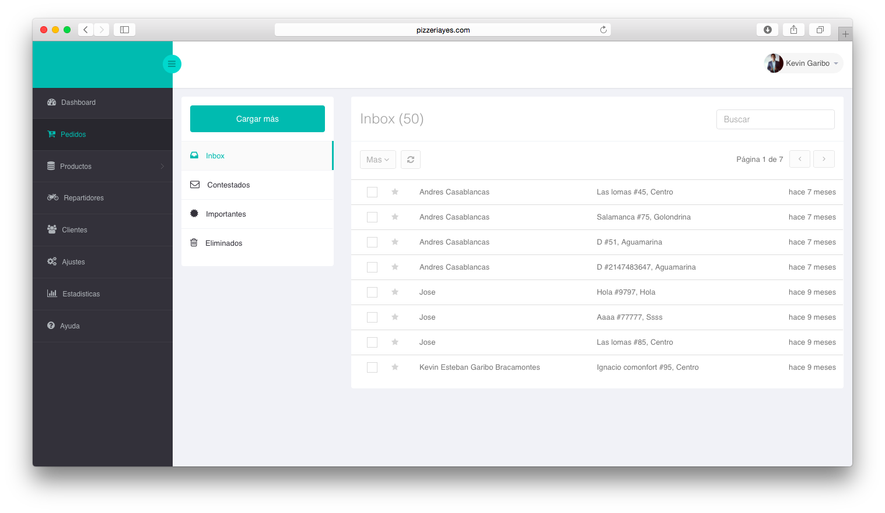
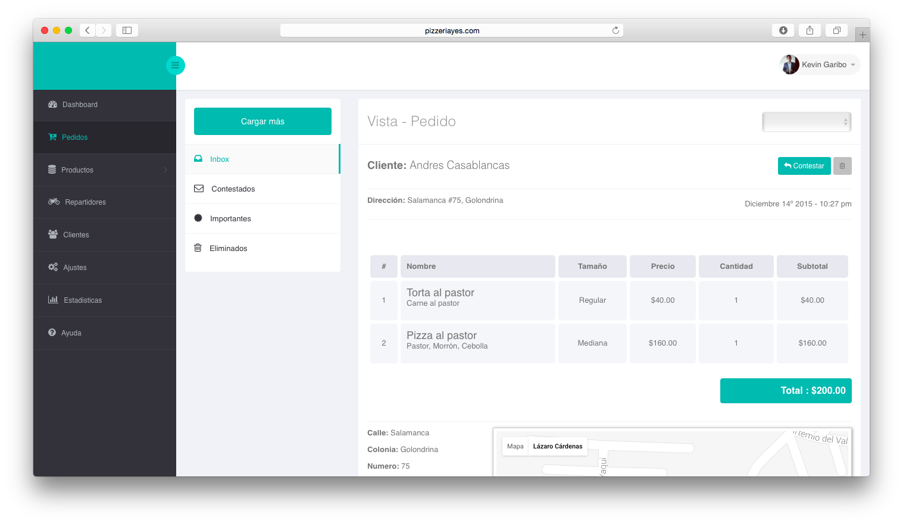
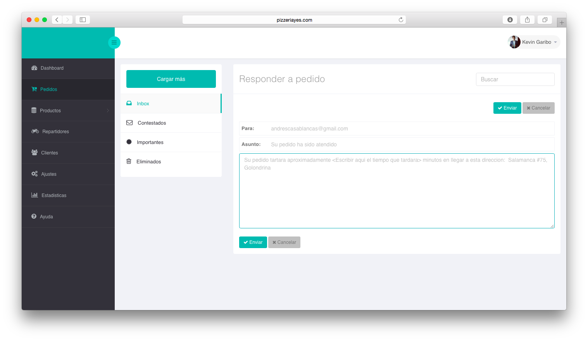
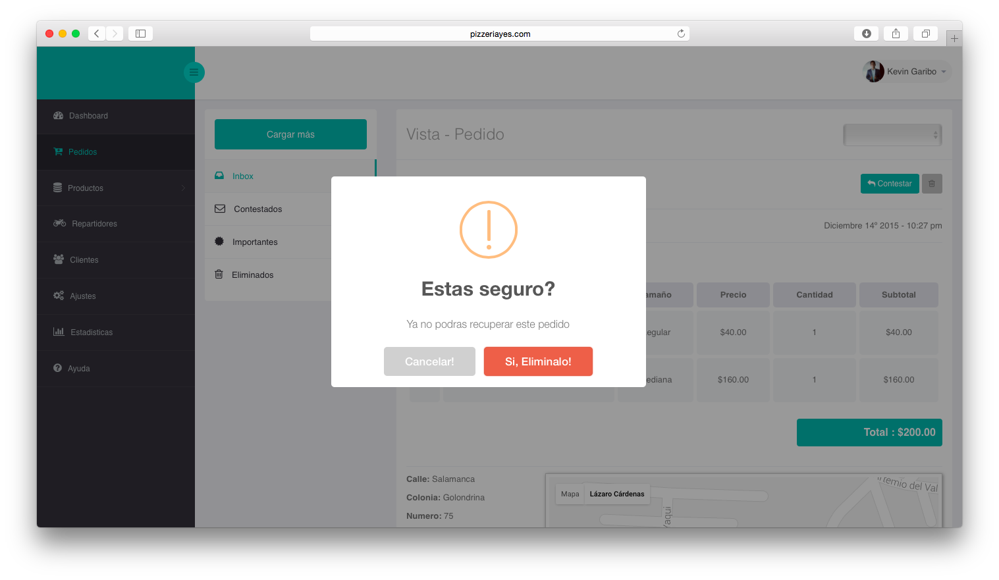
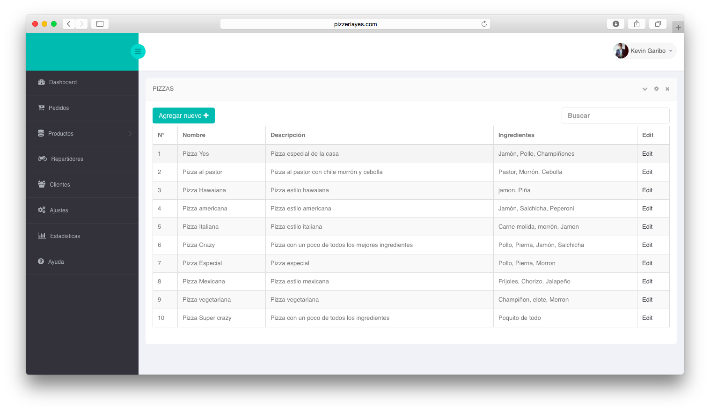
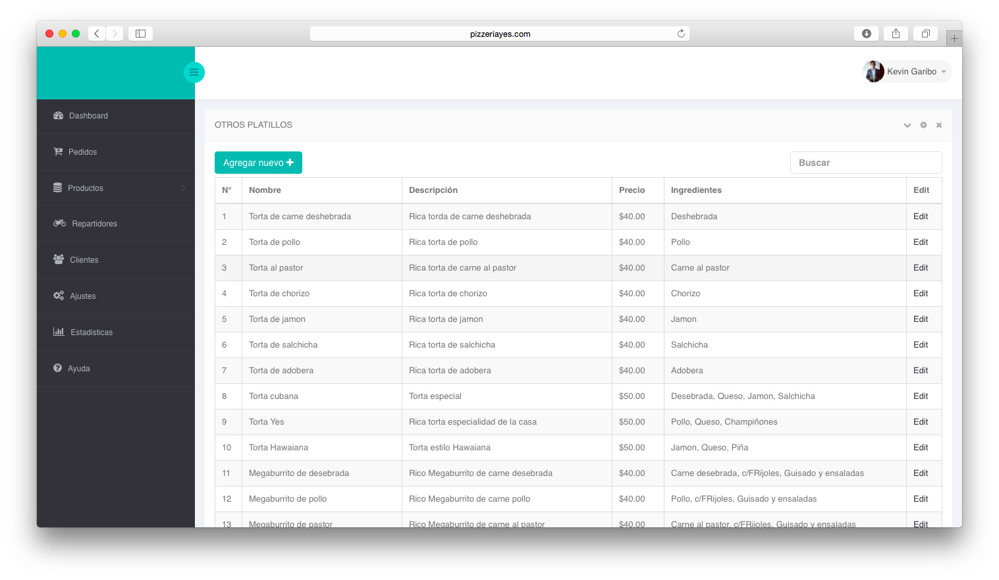
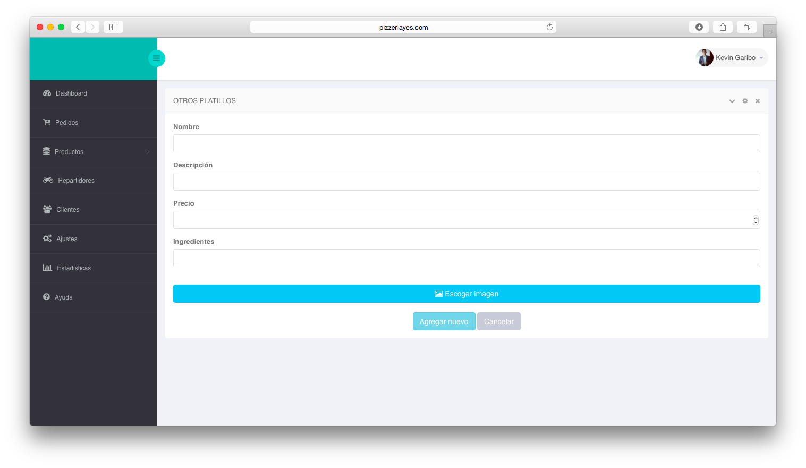
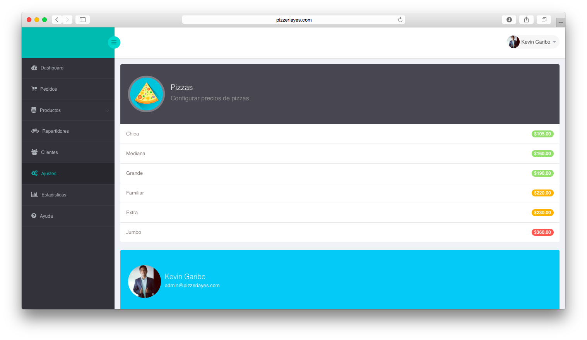
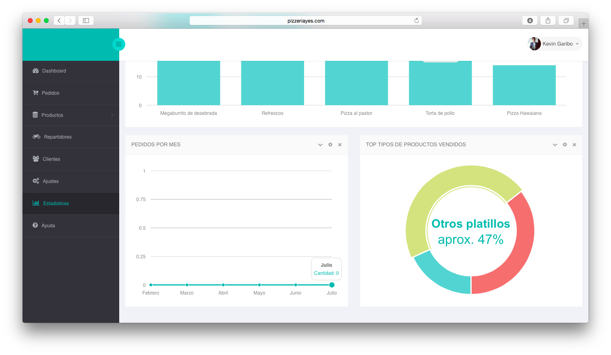

Dashboard de Sistema de pedidos a Pizzeria
============================================
Dashboard que forma parte de un sistema de pedido de productos a domicilio.
Este Dashboard toma y sirve datos de una aplicacion movil [YesApp](https://github.com/garibo/YesApp) desde la cual puedes hacer pedidos de comida a domicilio. 
Esta aplicacion web fue contruida usando los frameworks:
- [AngularJS]
- [JQuery]
- [Bootstrap]

Esta web App cuenta con diversos mopdulos que le permiten el control y registro de productos y clientes:
- Pedidos
- Productos
- repartidores
- Clientes
- Ajustes
- Estadisticas
- Ayuda

